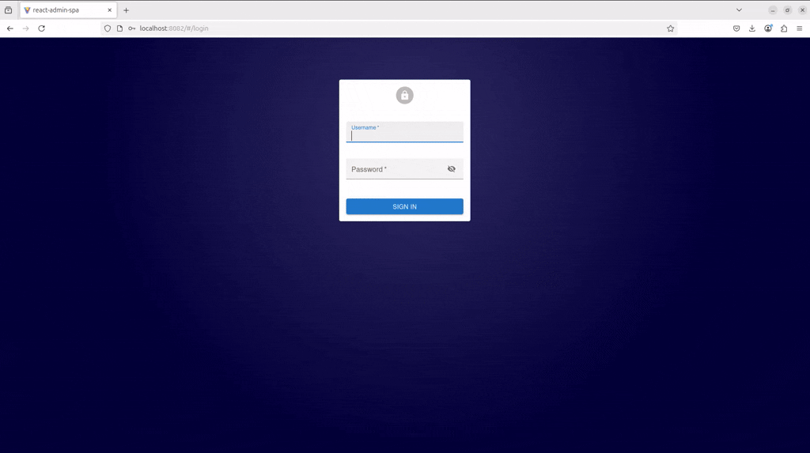

# Transaction Dispute Demo — Spring Boot API + Vite/React-Admin SPA

Demo of a Transaction Dispute system featuring a backend microservice layer and a frontend Vite/React Admin single page application (SPA)



---

## Table of Contents
- [Quick Start](#quickstart)
- [Architecture](#architecture)
- [Tech Stack](#tech-stack)
- [Repo Structure](#repo-structure)
- [Domain & Security](#domain--security)
- [API Overview](#api-overview)
- [Future Enhancements](#future-enhancements)

---

## Quick Start (Docker)

**Prereqs**: Docker & Docker Compose.

**Known Issues**
- SSL has not been enabled for demo purposes.
- The delete record button needs to be removed but has not for demo purposes.
- The Swagger UI purposely avoids security for demo purposes.

1) Build & run:
- docker compose build
- docker compose up -d

2) Open:
- Frontend (SPA): http://localhost:8082
- API / Swagger: http://localhost:8081/swagger-ui/index.html

3) Demo Login Credentials:
- admin / admin1234
- client / client1234
- client01 / client1234
- client02 / client1234<br/>
.<br/>
.<br/>
.<br/>
- client10 / client1234

---

## Architecture

```
┌──────────────────────────┐        HTTP/JSON        ┌──────────────────────────┐
│  React-Admin SPA         │  ───────────────────▶  │  Spring Boot API         │
│  (Vite + Nginx)          │   /api/v1/*, /auth/*    │  (WebMVC, Security, JPA) │
│                          │                         │                          │
│  - Auth form (JWT)       │   ◀──────────────────  │  - JWT login (/auth)     │
│  - Transactions (client) │       JSON responses    │  - Transactions,         │
│  - Disputes (admin)      │                         │    Disputes, Users       │
│  - Filters, modals       │                         │  - H2 in-memory DB       │
└──────────────────────────┘                         └──────────────────────────┘
            ▲                                                       │
            │ Swagger UI (for testing)                              │
            └───────────────────────────────────────────────────────┘
```


**Roles & behavior**
- **CLIENT**: sees only *their* Transactions and Disputes.
- **ADMIN**: sees Disputes (with user column) and Users.
- **Dispute flow**: `OPEN → UNDER_REVIEW → (RESOLVED | REJECTED)`; admin advances status.
- **JWT**: HS256 with `role` and `userId` claims.
- **CORS**: configured for the SPA origin.
- **Swagger bypass (optional)**: allow unauthenticated “Try it out” *only when* called from Swagger UI (by `Referer`).

---

## Tech Stack

**Backend**
- Spring Boot 3 (WebMVC, Security, Validation)
- Spring Data JPA (Hibernate), H2 (in-memory dev DB)
- JWT via `NimbusJwtEncoder/Decoder` (HS256)
- springdoc-openapi (Swagger UI)

**Frontend**
- React-Admin (Material UI) on Vite
- Client-side filtering/sorting/pagination
- MUI Dialog modals for dispute creation & status timeline
- Nginx for static hosting

**Testing**
- JUnit 5, Mockito, spring-security-test
- `@WebMvcTest` (controllers), `@DataJpaTest` (repositories), service unit tests

**Packaging**
- Docker (multi-stage images) & Docker Compose

---

## Repo Structure

```
tx-dispute/
├─ backend/ # Spring Boot app
│ ├─ src/main/java/com/example/txd/
│ │ ├─ TransactionDisputeApplication.java
│ │ ├─ config/ # SecurityConfig, Cors, DemoSeeder, Swagger bypass chain
│ │ ├─ controller/api/ # AuthApi, TransactionsApi, DisputesApi, UsersApi
│ │ ├─ dto/ # Request/Response DTOs
│ │ ├─ model/ # JPA: AppUser, Transaction, Dispute, etc.
│ │ ├─ repository/ # Spring Data repositories
│ │ ├─ security/ # Sec helper (extract role/userId)
│ │ └─ service/ # Business logic (scoping, transitions)
│ ├─ src/main/resources/application.yml  # Config file
│ ├─ src/test/java/... # Unit tests
│ └─ Dockerfile
│
├─ frontend/ # React-Admin Single Page Application (SPA)
│ ├─ src/
│ │ ├─ App.tsx # <Admin> + <Resource>s (Transactions, Disputes, Users)
│ │ ├─ authProvider.ts # login/me, 401/403 handling
│ │ ├─ dataProvider.ts # fetchJson + Authorization header + client filters
│ │ ├─ transactions.tsx # List + “Create/View Dispute” modals
│ │ ├─ disputes.tsx # List + Show + filters + Advance buttons
│ │ ├─ disputes/DisputeAdvanceButton.tsx
│ │ ├─ dateLocale.ts # international date formatting
│ │ ├─ ui.ts # shared MUI styles 
│ │ └─ types.ts # shared TS types
│ ├─ Dockerfile
│ └─ nginx.conf
│
├─ docker-compose.yml # spins up both services
├─ .env.example # sample env vars for compose
├─ .gitignore / .gitattributes
└─ README.md

```

## Domain & Security

**Entities**
- `AppUser { id, username, passwordHash, role }`
- `Transaction { id, reference, amount, currency, description, createdAt, user }`
- `Dispute { id, transactionRef, reason, status, openedAt, underReviewAt, resolvedAt, rejectedAt, updatedAt, user }`

**Repositories**
- `TransactionRepository`: `findByUser_Id`, `findByReference`
- `DisputeRepository`: user-scoped queries

**Services**
- **Scoping**:  
  `ADMIN` → `findAll()`; otherwise current user → `findByUser_Id(Sec.userId())`.
- **Transitions**: validate legal moves; set timestamps; `409` on invalid transitions.

**SecurityConfig**
- Resource server (JWT) for `/api/**`
- `permitAll`: `/api/auth/**`, `/v3/api-docs/**`, `/swagger-ui/**`
- CORS enabled + configured via `app.cors.*`
- **Swagger bypass** chain (optional): permits `/api/**` **only** when `Referer` contains `/swagger-ui` (review convenience).

---

## API Overview
**Auth**
- POST /api/auth/login → { token }
- GET /api/auth/me → { id, username, role } (Bearer required)
  
**Transactions**
- GET /api/v1/transactions → list (admin: all; client: own)
- GET /api/v1/transactions/{id} → get (scoped)
  
**Disputes**
- GET /api/v1/disputes → list (admin: all; client: own)
- GET /api/v1/disputes/{id} → show (scoped)
- POST /api/v1/disputes → create (client/admin)
- POST /api/v1/disputes/{id}:advance → admin-only; validates legal transitions
  
**Users (admin only)**
- GET /api/v1/users

## Future Enhancements

- **Database & Schema**
  - Move from H2 → **PostgreSQL** (via Docker Compose service & volume).
  - Use **UUID primary keys**, add indexes/uniques (e.g., `transaction.reference`).
  - Add soft-delete/audit columns (`created_by`, `updated_by`, `deleted_at`).

- **API & Backend**
  - **Server-side pagination/sorting/filtering** (Spring Data `Pageable`, JPA Specifications).
  - **Rate limiting** (Bucket4j) and request **idempotency keys** for POST.
  - Caching layers (Spring Cache + **Redis**) for read-heavy queries.
  - **Validation groups** & richer constraints for create vs. update.
  - Webhooks/events for dispute status changes (outbox pattern).

- **Auth & Security**
  - **Short-lived access tokens** + **refresh tokens** (rotation, revocation list).
  - Harden password policy, account lockout, 2FA option.
  - SSO (**OAuth2/OpenID Connect**) for admin users.

- **Observability & Ops**
  - **OpenTelemetry** tracing; ship traces/logs to a collector.
  - **Prometheus** metrics + **Grafana** dashboards (HTTP, DB, JVM).
  - Structured JSON logging with correlation IDs.
  - Health/readiness probes; **Kubernetes** manifests

- **CI/CD**
  - GitHub Actions: build, test, **Testcontainers** integration tests, image publish.
  - Static analysis (**Checkstyle/SpotBugs**), dependency audits, Dependabot.
  - Multi-stage, multi-arch Docker builds; image signing (Sigstore/Cosign).

- **Frontend (React-Admin)**
  - Switch lists to **server-driven** pagination & filters (consistent totals).
  - **i18n** (react-admin polyglot) & a11y improvements; dark theme.
  - E2E tests (Playwright/Cypress) + unit tests (RTL/Jest).
  - File uploads (attachments on disputes)

- **Features & UX**
  - Dispute **comments & attachments**; internal vs. external notes.
  - SLA timers, escalation rules, and notifications (email/webhook).
  - Admin analytics (charts for volumes, outcomes, SLAs).
  - Advanced search (multi-field, date ranges, status combos).

- **Hardening & Performance**
  - Query tuning and selective DTO projections.
  - Background jobs for heavy tasks (Spring Batch/Scheduler).
  - Data retention & archival strategy.

